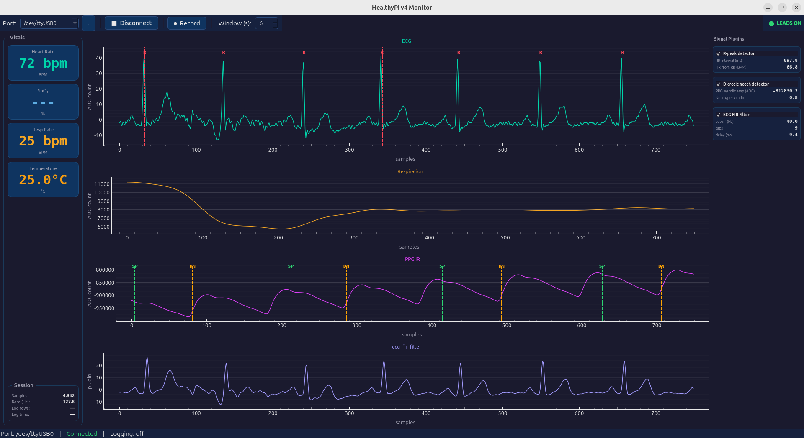
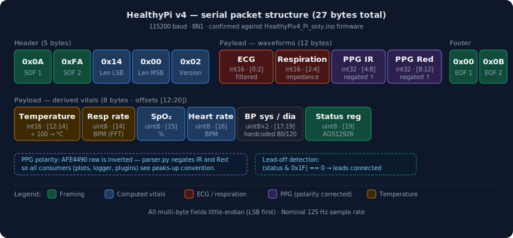
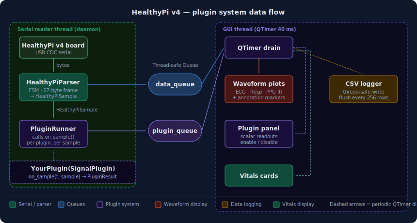

# HealthyPi v4 Monitor

A PyQt6 desktop application for real-time acquisition, visualisation, and logging of physiological signals from the [ProtoCentral HealthyPi v4](https://github.com/Protocentral/protocentral_healthypi_v4) board.

> Designed by Oscar Yáñez Suárez as a fully open teaching tool — students can add real-time signal processing algorithms through a simple plugin interface.

[](LICENSE)
[](https://python.org)
[](https://pypi.org/project/PyQt6/)

---

## Screenshots



---

## Features

- **Real-time waveforms** — ECG, Respiration, and PPG IR at 125 Hz via pyqtgraph
- **Vitals panel** — Heart Rate, SpO₂, Respiration Rate, Temperature
- **Lead-on/off indicator** — reads ADS1292R status register directly from the packet
- **Threaded capture** — serial I/O in a daemon thread; the GUI never blocks
- **CSV data logging** — timestamped, auto-named files; plugin signal columns included automatically
- **Plugin interface** — add real-time DSP in a single Python file; plugins can output event annotations, scalar readouts, and continuous waveform signals that appear as extra scrolling plots and CSV columns
- **Adjustable display window** — 2 to 30 seconds of scrolling history
- **Editable UI layout** — toolbar and panels defined in `.ui` files, editable in Qt Designer
- **Bilingual UI** — English and Spanish at runtime via Settings → Language; choice persisted across sessions
- **Dark theme** throughout

---

## Installation

```bash
git clone https://github.com/<your-username>/healthypi_v4_gui.git
cd healthypi_v4_gui
pip install -r requirements.txt
```

**Linux** — add yourself to the `dialout` group if you get a serial permission error:

```bash
sudo usermod -aG dialout $USER   # log out and back in after
```

**macOS** — no extra steps; the CP210x driver ships with macOS 12+.

**Windows** — install the [Silicon Labs CP210x driver](https://www.silabs.com/developers/usb-to-uart-bridge-vcp-drivers) if the port does not appear.

---

## Running

```bash
python main.py
```

1. Select the correct serial port from the dropdown (`/dev/ttyUSB0`, `COM3`, etc.).
2. Press **Connect**.
3. Attach ECG electrodes and SpO₂ probe — the **LEADS ON** indicator turns green.
4. Press **Record** to start a CSV session; choose a save path when prompted.

> **Recording tip:** Start recording *after* connecting so that all active plugin signal channels are included in the CSV header. Any channel that appears after recording starts will not have a column in that session's file.

---

## Project structure

```
healthypi_v4_gui/
├── main.py                      Entry point — MainWindow, runtime widget wiring
├── requirements.txt
├── ReadHealthyPi4CSVs.ipynb     Jupyter notebook for post-recording analysis
├── ui/
│   ├── main_window.ui           Main window layout (Qt Designer)
│   └── vitals_panel.ui          Vitals group box layout (Qt Designer)
├── core/
│   ├── parser.py                Byte-level FSM packet decoder (PPG polarity here)
│   ├── serial_reader.py         Daemon thread — pyserial + PluginRunner hook
│   ├── logger.py                Thread-safe CSV writer with dynamic signal columns
│   ├── ring_buffer.py           NumPy ring buffer for waveform display
│   ├── plugin_base.py           SignalPlugin ABC, PluginResult, Annotation
│   └── plugin_runner.py         Dispatches on_sample() to registered plugins
├── plugins/
│   ├── r_peak_detector.py       Pan-Tompkins-inspired QRS detector
│   ├── ppg_notch_detector.py    Dicrotic notch detector
│   ├── ecg_fir_filter.py        Windowed-sinc FIR low-pass filter (signal output)
│   └── ecg_passthrough.py       Identity plugin — useful for pipeline debugging
├── resources/
│   └── i18n.py                  EN/ES translation dictionaries + tr() function
└── assets/
    ├── packet_structure.svg
    └── plugin_flow.svg
```

---

## Serial packet structure

The board streams 27-byte packets at ~125 Hz over USB CDC (115200 baud, 8N1).
Protocol confirmed against the `HealthyPiv4_Pi_only.ino` firmware source.



> **PPG polarity:** The AFE4490 raw ADC value is inversely proportional to blood volume. `parser.py` negates both `ppg_ir` and `ppg_red` at decode time so all downstream consumers — plots, logger, plugins — see the physiologically correct convention: systolic peaks deflect upward. This negation is the single source of truth; plugins receive already-corrected values.

---

## Plugin interface



Data flows from the board through three stages:

1. **Serial reader thread** — reads raw bytes, feeds the FSM parser, produces `HealthyPiSample` objects at ~125 Hz.
2. **Plugin runner** — still inside the serial thread, calls `on_sample()` on every registered plugin for every sample and enqueues results.
3. **GUI timer** — a `QTimer` fires every 40 ms in the main thread, drains both queues, updates waveform plots, vitals cards, annotation overlays, plugin panel, and logger.

Your plugin code lives entirely in step 2. You never touch the GUI.

### Quick start

1. Create a file in `plugins/`, e.g. `plugins/my_plugin.py`.
2. Subclass `SignalPlugin` and implement `on_sample()`.
3. Register it in `main.py` by adding it to `self._plugins`.

```python
# plugins/my_plugin.py
from core.plugin_base import SignalPlugin, PluginResult, Annotation

class MyPlugin(SignalPlugin):
    name    = "My plugin"   # shown in the plugin panel
    enabled = False         # starts unchecked; user enables in the plugin panel

    def on_connect(self, sample_rate: float) -> None:
        self.fs = sample_rate   # initialise filter state here

    def on_sample(self, t: float, sample) -> PluginResult | None:
        # called at ~125 Hz in the serial reader thread
        filtered = ...   # your processing here

        return PluginResult(
            annotations=[Annotation(channel="ecg", label="R", color="#ff4757")],
            scalars={"my_value": 42.0},
            signals={"my_signal": filtered},
        )

    def on_disconnect(self) -> None:
        pass   # release state if needed
```

```python
# main.py
from plugins.my_plugin import MyPlugin
self._plugins = [RPeakDetector(), DicroticNotchDetector(), ECGFIRFilter(), MyPlugin()]
```

### `SignalPlugin` — base class

```python
class SignalPlugin(ABC):
    name:    str    # shown in the GUI panel
    enabled: bool   # default True; user can toggle at runtime
```

| Method | When called | Thread |
|--------|-------------|--------|
| `on_connect(sample_rate)` | Serial port opens | Serial thread |
| `on_sample(t, sample)` | Every decoded packet (~125 Hz) | Serial thread |
| `on_disconnect()` | Serial port closes | Serial thread |

### `HealthyPiSample` — the data object

```python
@dataclass
class HealthyPiSample:
    ecg:          int    # int16 — filtered ECG ADC count
    respiration:  int    # int16 — chest impedance ADC count
    ppg_ir:       int    # int32 — PPG infrared (polarity corrected, peaks up)
    ppg_red:      int    # int32 — PPG red channel (polarity corrected)
    temperature:  float  # °C
    resp_rate:    int    # BPM — FFT-derived on the board
    spo2:         int    # %
    heart_rate:   int    # BPM
    bp_sys:       int    # placeholder — firmware hardcodes 80
    bp_dia:       int    # placeholder — firmware hardcodes 120
    status:       int    # ADS1292R status register byte
    leads_on:     bool   # True when (status & 0x1F) == 0
```

### `PluginResult` — what you return

```python
@dataclass
class PluginResult:
    annotations: list[Annotation]  = []   # event markers on the waveform plots
    scalars:     dict[str, float]  = {}   # named values in the plugin panel
    signals:     dict[str, float]  = {}   # continuous waveform values
```

All three fields are optional — return only what you need.

**`Annotation`** — draws a dashed vertical line with a label on a hardware waveform plot. Positioning is automatic: the marker is placed at the sample being processed when `on_sample()` returned, scrolls in lockstep with the waveform, and expires after 10 seconds.

```python
Annotation(
    channel = "ecg",       # "ecg" | "respiration" | "ppg_ir" | "ppg_red"
    label   = "R",         # ≤ 8 chars recommended
    color   = "#ff4757",   # HTML colour
)
```

**`scalars`** — key/value pairs displayed in the plugin panel. Rows appear the first time a key is seen and update on every subsequent result.

**`signals`** — continuous waveform output. Each key creates a new scrolling plot below the hardware plots the first time it appears, and adds a column to the CSV log. The output channel name is derived from the plugin `name` attribute by default (lowercase, spaces → underscores), or set explicitly as the dict key.

### Threading rules

`on_sample()` runs in the **serial reader thread**, not the GUI thread.

| You can | You must not |
|---------|--------------|
| Use NumPy arrays (releases the GIL) | Touch any `QWidget` or Qt object |
| Maintain `self` state | Call `QTimer`, `QApplication`, etc. |
| Use `collections.deque` | Block for I/O or `time.sleep()` |
| Raise exceptions (caught and printed) | Take more than ~1 ms per call |

There is an inherent ~40 ms latency between `on_sample()` firing and the GUI updating (one `QTimer` tick). For annotations this is handled transparently — each result carries a `sample_index` counter that stays in lockstep with the ring buffer, so markers land on the correct sample regardless of when the result is processed.

---

## Included plugins

### R-peak detector (`plugins/r_peak_detector.py`)

Simplified Pan-Tompkins QRS detector operating on the ECG channel.

Pipeline: `ECG → low-pass MA → derivative → square → integrator → adaptive threshold → refractory`

Key parameters:

```python
REFRACTORY_MS   = 200    # min ms between R peaks
THRESHOLD_COEF  = 0.45   # fraction of running max used as threshold
LP_ORDER        = 5      # low-pass filter length (samples)
INT_ORDER       = 15     # integrator length (samples)
```

Returns an `"R"` annotation on the ECG plot and `RR interval (ms)` / `HR from RR (BPM)` scalars on each detection.

### Dicrotic notch detector (`plugins/ppg_notch_detector.py`)

Detects systolic peaks and dicrotic notch on the PPG IR channel. The dicrotic notch is the brief secondary dip caused by aortic valve closure, visible on the descending limb of each pulse.

Pipeline: `PPG IR → Gaussian smooth → 1st derivative → peak detection → notch search`

Key parameters:

```python
SMOOTH_ORDER           = 9     # Gaussian MA window (samples, odd)
NOTCH_SEARCH_START_MS  = 150   # search window start after systolic peak
NOTCH_SEARCH_END_MS    = 500   # search window end
PEAK_THRESHOLD_COEF    = 0.40  # min amplitude fraction to accept a peak
```

Returns `"SP"` (systolic peak) and `"DN"` (dicrotic notch) annotations on the PPG plot, and `PPG systolic amp` / `Notch/peak ratio` scalars.

### FIR low-pass filter (`plugins/ecg_fir_filter.py`)

Windowed-sinc (Hamming) linear-phase FIR filter on the ECG channel. Outputs the filtered waveform as a plugin signal plot and CSV column. Unlike a moving average, this has a well-defined frequency response with a flat passband — P waves and QRS morphology are preserved up to the cutoff frequency.

Key parameters:

```python
CUTOFF_HZ = 40.0   # low-pass cutoff frequency in Hz
NUM_TAPS  = 9      # filter length — more taps = sharper transition, more delay
                   # group delay = (NUM_TAPS - 1) / 2 samples
```

Accepts constructor arguments so multiple instances can compare cutoffs side by side:

```python
from plugins.ecg_fir_filter import ECGFIRFilter
self._plugins = [
    ...,
    ECGFIRFilter(name="ECG FIR 40 Hz", cutoff_hz=40),
    ECGFIRFilter(name="ECG FIR 20 Hz", cutoff_hz=20),
]
```

### Passthrough (`plugins/ecg_passthrough.py`)

Copies raw ECG to a signal output with no processing. Useful for verifying the display pipeline: if the passthrough plot matches the ECG plot exactly, any distortion seen in another plugin is in that plugin's algorithm, not in the framework.

---

## Analysing recorded CSV files

A Jupyter notebook is included to get you started with post-recording analysis:

```
ReadHealthyPi4CSVs.ipynb
```

It demonstrates how to load a recording into a pandas DataFrame, inspect the available columns (including any plugin signal columns such as `ecg_fir_filter`), and produce basic plots — ECG raw vs filtered, and scaled/mean-removed PPG IR and Red channels side by side.

**Requirements:**

```bash
pip install jupyter numpy pandas matplotlib
jupyter notebook ReadHealthyPi4CSVs.ipynb
```

Set the `FILE` variable in the first cell to the path of your recording before running.

---

## UI layout files

The main window layout and vitals panel are defined in `.ui` files under `ui/` and loaded at runtime with `PyQt6.uic.loadUi()`. You can open and edit them in Qt Designer without touching Python.

```
ui/main_window.ui    QMainWindow — toolbar, three-column central layout, status bar
ui/vitals_panel.ui   Vitals group box — vital card placeholders, session stats grid
```

The plots area and plugin panel are built at runtime from plugin registration data and are therefore not described in `.ui` files.

---

## Dependencies

| Package | Version | Purpose |
|---------|---------|---------|
| PyQt6 | ≥ 6.4 | GUI framework |
| pyqtgraph | ≥ 0.13 | Real-time waveform plots |
| pyserial | ≥ 3.5 | Serial port I/O |
| numpy | ≥ 1.23 | Ring buffer, DSP in plugins |

---

## License

GPL-3.0 — see [LICENSE](LICENSE).

Hardware protocol details are based on the [ProtoCentral HealthyPi v4](https://github.com/Protocentral/protocentral_healthypi_v4) firmware, released under the MIT License.
